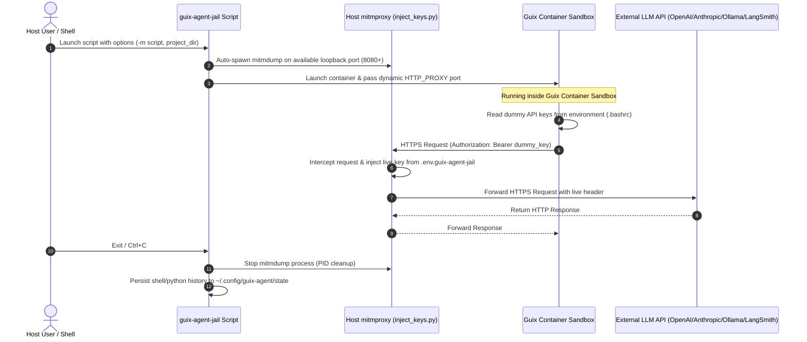

# Guix Agent Jail: Zero-Trust Runtime & Credential Isolation Proxy

**Author:** Steven J Holtz

## Overview

This repository provides an enterprise-grade execution sandbox for autonomous AI agents. By combining GNU Guix containerization with host-side man-in-the-middle credential proxying, this setup establishes a strict zero-trust boundary around agent workloads.

When building or running LLM agents with code execution capabilities, prompt injection or unintended file modifications pose critical security threats. This project mitigates both unintended filesystem modifications and API key exfiltration:

1. **Filesystem Containment**: The agent runs inside an isolated GNU Guix File Hierarchy Standard (FHS) container. It has access only to a dedicated project directory and an isolated temporary home directory. Persistent tool state and shell histories are safely vaulted in host state storage.

2. **Credential Isolation**: Real API credentials never enter the container environment. The agent is injected with dummy keys, while outbound HTTPS traffic is transparently routed through an automatically managed host-level proxy (`mitmproxy`) that injects valid API keys on the fly.

## Threat Model & Security Guarantees

| Attack Vector | Vulnerability / Impact | Sandbox Mitigation Strategy |
|---|---|---|
| Prompt Injection / Credential Theft | Agent reads `~/.env`, `OPENAI_API_KEY`, or history to leak keys. | Container only contains dummy key values. Real keys reside on the host. |
| Arbitrary Host Modification | Agent modifies host configuration files (`~/.bashrc`, `/etc/`, etc.). | Container limited to `/workspace`, temporary home, uv cache directories. |
| Data Exfiltration | Agent reads arbitrary files and transmits them externally. | Host filesystem is not available except project directory passed as an argument. |
| MitM Interception Bypass | Agent bypasses HTTPS proxying or drops custom certificates. | `SSL_CERT_FILE` and `*_CA_BUNDLE` enforce trust in mitmproxy CA certificates. |

## System Architecture

The following diagrams illustrate how outbound LLM API requests originate from within the container with dummy keys and are transparently authorized at the host proxy boundary.

### ASCII Architecture Diagram

```
  +------------------------------------------------------------------------------------------+
  | HOST MACHINE                                                                             |
  |                                                                                          |
  |  +-------------------------------+             +-------------------------------------+   |
  |  | .env.guix-agent-jail          |             | mitmproxy (inject_keys.py)          |   |
  |  | - HOST_OPENAI_API_KEY         |------------>| - Intercepts requests on port 8080  |   |
  |  | - HOST_ANTHROPIC_API_KEY      |             | - Identifies target host domain     |   |
  |  | - HOST_OLLAMA_API_KEY         |             | - Injects real API keys into header |   |
  |  | - HOST_LANGSMITH_API_KEY      |             +------------------+------------------+   |
  |  +-------------------------------+                                ^                      |
  |                                                                   |                      |
  |  +-------------------------------------------------------------+  | HTTPS                |
  |  | GUIX CONTAINER ISOLATION                                    |  | (mitmproxy CA Trust) |
  |  |                                                             |  |                      |
  |  |  +-----------------------+    +--------------------------+  |  |                      |
  |  |  | Agent Process (uv/py) |    | Container Env (.bashrc)  |  |  |                      |
  |  |  | - Executes agent code |--->| - HTTP_PROXY=꞉PORT       |--+--+                      |
  |  |  | - Operates on         |    | - OPENAI_KEY="dummy_key" |  |                         |
  |  |  |   /workspace only     |    | - SSL_CERT_FILE set      |  |                         |
  |  |  +-----------------------+    +--------------------------+  |                         |
  |  |              |                                              |                         |
  |  |              v                                              |                         |
  |  |  +-----------------------+                                  |                         |
  |  |  | Shared Directory      |                                  |                         |
  |  |  | /workspace            |                                  |                         |
  |  |  | (Host $PROJECT_DIR)   |                                  |                         |
  |  |  +-----------------------+                                  |                         |
  |  +-------------------------------------------------------------+                         |
  +------------------------------------------------+-----------------------------------------+
                                                   | Upstream HTTPS Request
                                                   | with Valid Header
                                                   v
                                     +------------------------------+
                                     | External Provider APIs       |
                                     | - api.openai.com             |
                                     | - api.anthropic.com          |
                                     | - ollama.com                 |
                                     | - api.smith.langchain.com    |
                                     +------------------------------+
```

### Sequence Diagram



## Component Breakdown

### 1. Container Jail Script (`guix-agent-jail`)

The shell launcher creates a lightweight, isolated GNU Guix container with FHS emulation and manages background dependencies:

- **Command Line Interface**: Supports flexible flags for passing custom mitmproxy scripts (`-m`) and specifying the target project directory.

- **Automated Proxy Lifecycle**: Dynamically finds an open port (starting at port `8080`), spawns `mitmdump` bound strictly to loopback (`127.0.0.1`), verifies health, and registers signal traps to guarantee proxy cleanup upon exit.

- **Persistent History Vaulting**: Preserves container command histories (`.bash_history`, `.python_history`, `.lesshst`) in host storage (`~/.config/guix-agent/state`) across sandbox executions with secure permissions.

- **Package Manifest**: Provisions `gcc-toolchain`, `uv`, `python`, `git`, `curl`, `nss-certs`, and common utilities.

- **Mount Isolation**: Shares the project directory as `~/workspace`, creates an isolated temporary home directory, and mounts host cache directories for `uv` (`.cache/uv`, `.local/share/uv`).

- **Certificate Mount**: Exposes `$HOME/.mitmproxy` read-only so the container can validate proxy TLS certificates.

### 2. Mitmproxy Key Injector (`inject_keys.py`)

A Python add-on for `mitmproxy` running on the host machine:

- Intercepts outbound requests to supported provider domains (`api.openai.com`, `api.anthropic.com`, `ollama.com`, `api.smith.langchain.com`).

- Loads header mappings from `~/.config/guix-agent/key-injector.toml`.

- Loads live environment secrets from `.env.guix-agent-jail` located in the parent directory of the current workspace.

- Selects the appropriate header configuration based on the target host and injects the corresponding API key.

- Supports `Authorization` headers with optional prefixes such as `Bearer ` and `x-api-key` headers.

- Supports an alternate TOML configuration path through a `KEY_INJECTOR_CONFIG` environment variable.

- Replaces or sets request headers and injects genuine API keys dynamically.

### 3. Container Shell Configuration (`bashrc`)

The container shell template (`~/.config/guix-agent/bashrc`):

- Automatically receives the dynamically allocated proxy port via sed substitution.

- Exports dummy environment variables (`OPENAI_API_KEY`, `ANTHROPIC_API_KEY`, etc.) to satisfy client library initialization requirements.

- Routes all network communication through `http://127.0.0.1:PORT` via `HTTP_PROXY` and `HTTPS_PROXY`.

- Explicitly points `SSL_CERT_FILE` and `REQUESTS_CA_BUNDLE` to the proxy certificate.

## Quickstart Guide

### Prerequisites

- [GNU Guix](https://guix.gnu.org/) installed on the host operating system.
- [mitmproxy](https://mitmproxy.org/) installed on the host machine.

### Installation & Setup

1. Clone the repository:
   ```bash
   git clone https://github.com/sjholtz/guix-agent-jail.git
   cd guix-agent-jail
   ```

2. Place the mitmproxy injector script in your home binary path and place its configuration file in the default configuration directory:
   ```bash
   mkdir -p ~/bin
   cp inject_keys.py ~/bin/
   mkdir -p ~/.config/guix-agent
   cp key-injector.toml ~/.config/guix-agent/
   ```

3. Configure host credentials:

   Copy the example environment template to your project's parent directory:
   ```bash
   cp .env.example /<path>/.env.guix-agent-jail
   # Edit .env.guix-agent-jail with your provider keys
   ```

   The `<path>` here must be to the **parent** directory of the project directory that your agent code is in. For example, if your code is in `/home/<user>/my-project/src/`, the `.env.guix-agent-jail` file must reside in `/home/<user>/my-project/`.

   Edit the `.env.guix-agent-jail` file with your live provider API keys.

   The configuration path override can also be placed in this file. For example:
   ```bash
   KEY_INJECTOR_CONFIG=/home/<user>/.config/guix-agent/key-injector.toml
   ```

### Configure Header Injection

The injector reads provider mappings from `~/.config/guix-agent/key-injector.toml` by default. This file contains no secrets; it simply maps target host URLs to environment variable names.

To use a different configuration file, add it to the parent-directory `.env.guix-agent-jail` file exactly as shown above, or export `KEY_INJECTOR_CONFIG=<path>/key-injector.toml` before launching the sandbox, as shown below:

```bash
export KEY_INJECTOR_CONFIG=/path/to/key-injector.toml
guix-agent-jail
```

The `key-injector.toml` file looks like this:

```toml
[auth]

[[auth.headers]]
host = "api.openai.com"
environment_variable = "HOST_OPENAI_API_KEY"

[[auth.headers]]
host = "ollama.com"
environment_variable = "HOST_OLLAMA_API_KEY"

[x-api]

[[x-api.headers]]
host = "api.anthropic.com"
environment_variable = "HOST_ANTHROPIC_API_KEY"

[[x-api.headers]]
host = "api.smith.langchain.com"
environment_variable = "HOST_LANGSMITH_API_KEY"
```

The `[auth]` section injects the `Authorization` header. The `[x-api]` section injects the `x-api-key` header. Host matching supports an exact domain or a subdomain.

Python 3.11 or newer is required because the loader uses the standard library `tomllib` module.

The user should edit this file as needed to add or remove hosts that need API key access from within the container.

### Usage & Command Options

The sandbox launcher automatically starts and stops `mitmdump` in the background.

```bash
guix-agent-jail [-h] [-m inject_keys_path] [project_dir]
```

#### Arguments & Options

- `-h`: Display usage information and exit.
- `-m inject_keys_path`: Path to the mitmproxy Python script. (Default: `$HOME/bin/inject_keys.py`).
- `project_dir`: Path to the Python project directory that will be accessible inside the Guix container. (Default: current working directory).

#### Examples

- Launching from your project directory:
  ```bash
  cd /home/<user>/project_dir/src/
  guix-agent-jail
  ```

- Specifying a project directory explicitly:
  ```bash
  guix-agent-jail /home/<user>/my-project/src/
  ```

- Specifying a non-default location for mitmproxy key injector script:
  ```bash
  guix-agent-jail -m /custom/path/inject_keys.py
  ```

## Security & Key Management Best Practices

- **Repository Sanitation**: Never commit `.env.guix-agent-jail` or live secrets. Keep `.env.guix-agent-jail` listed in your project's `.gitignore`.

- **Certificate Security**: Treat the generated `mitmproxy-ca-cert.pem` certificate securely, as it permits local decryption of container-initiated TLS traffic.

- **Key Rotation**: If keys are exposed or compromised during development, immediately revoke them in your API provider dashboard and generate new keys.
